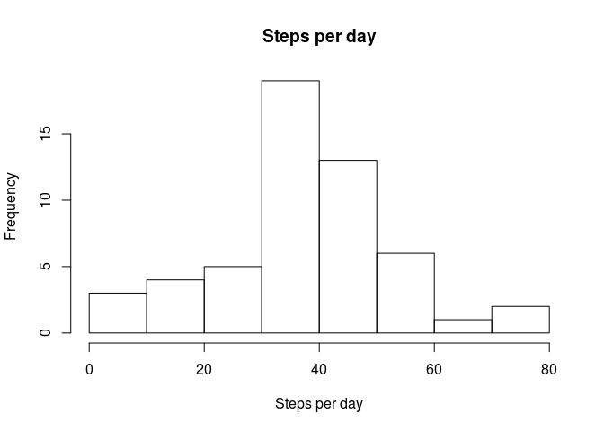
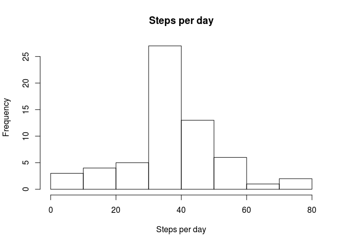
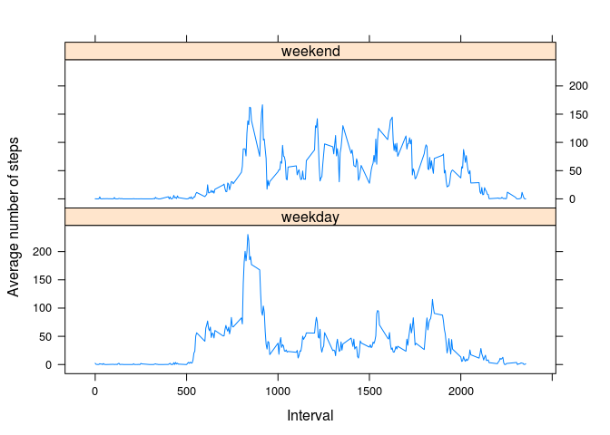

# Reproducible Research: Peer Assessment 1


## Loading and preprocessing the data
From summary of data we can see that only "steps" column has NA values. We'll remove filter them out for further analysis

```r
data = read.csv("activity.csv")
summary(data)
```

```
##      steps                date          interval     
##  Min.   :  0.00   2012-10-01:  288   Min.   :   0.0  
##  1st Qu.:  0.00   2012-10-02:  288   1st Qu.: 588.8  
##  Median :  0.00   2012-10-03:  288   Median :1177.5  
##  Mean   : 37.38   2012-10-04:  288   Mean   :1177.5  
##  3rd Qu.: 12.00   2012-10-05:  288   3rd Qu.:1766.2  
##  Max.   :806.00   2012-10-06:  288   Max.   :2355.0  
##  NA's   :2304     (Other)   :15840
```

```r
dataNoNA = data[!is.na(data$steps),]
```

## What is mean total number of steps taken per day?

```r
stepsByDate = aggregate(dataNoNA$steps, list(dataNoNA$date), mean)
sum = summary(stepsByDate[,2])
sum[3]
```

```
## Median 
##  37.38
```

```r
sum[4]
```

```
##  Mean 
## 37.38
```

```r
hist(stepsByDate[,2], xlab="Steps per day", main = "Steps per day")
```

 

## What is the average daily activity pattern?

```r
stepsByInterval = aggregate(dataNoNA$steps, list(dataNoNA$interval), mean)
plot(stepsByInterval, type="l", xlab="Interval", ylab="Average number of steps")
```

 

Interval number with maximal average steps:

```r
names(stepsByInterval) = c('interval', 'steps')
stepsByInterval[which.max(stepsByInterval$steps),]$interval
```

```
## [1] 835
```

## Imputing missing values
From summary of data we can see that only "steps" column has NA values.

```r
summary(data)
```

```
##      steps                date          interval     
##  Min.   :  0.00   2012-10-01:  288   Min.   :   0.0  
##  1st Qu.:  0.00   2012-10-02:  288   1st Qu.: 588.8  
##  Median :  0.00   2012-10-03:  288   Median :1177.5  
##  Mean   : 37.38   2012-10-04:  288   Mean   :1177.5  
##  3rd Qu.: 12.00   2012-10-05:  288   3rd Qu.:1766.2  
##  Max.   :806.00   2012-10-06:  288   Max.   :2355.0  
##  NA's   :2304     (Other)   :15840
```
Total number of NA values:

```r
sum(is.na(data$steps))
```

```
## [1] 2304
```

Substituting NA values with mean for that 5-minute interval and calculating steps per day:

```r
dataNA = data[is.na(data$steps),]
merged = merge(dataNA, stepsByInterval, by.x="interval", by.y="interval")
merged = subset(merged, select = -c(steps.x)) # remove NA's column
names(merged)[names(merged)=="steps.y"] = "steps" # rename merged mean steps column
dataSubNA = rbind(dataNoNA,merged)

stepsByDate = aggregate(dataSubNA$steps, list(dataSubNA$date), mean)
sum = summary(stepsByDate[,2])
sum[3]
```

```
## Median 
##  37.38
```

```r
sum[4]
```

```
##  Mean 
## 37.38
```
Mean and median remained unchanged. Historgram showed an increase of frequecy along the mean value, which is expected, since we added more values with mean values.

```r
hist(stepsByDate[,2], xlab="Steps per day", main = "Steps per day")
```

 

## Are there differences in activity patterns between weekdays and weekends?

For the following analysis Saturday and Sunday were considered as weekends.

```r
dataSubNA$isWeekEnd = weekdays(as.Date(dataSubNA$date)) %in% c("Saturday", "Sunday")
dataSubNA$isWeekEnd = factor(ifelse(dataSubNA$isWeekEnd,"weekend","weekday"))

library(lattice)
stepsByInterval1 = aggregate(dataSubNA$steps, list(dataSubNA$interval, dataSubNA$isWeekEnd), mean)
names(stepsByInterval1) = c("interval", "isWeekEnd", "steps")
xyplot(steps ~ interval | isWeekEnd, data = stepsByInterval1, type="l", layout=c(1,2), xlab="Interval", ylab="Average number of steps")
```

 

There are some differences in activity between weekdays and weekends, but not significant. Peak activity appear to be around 800th interval, whereas during weekday it reaches above 200 steps and during weekend it's situated around 150 steps. Activity thoroughout the rest of the day seems to be the same.
